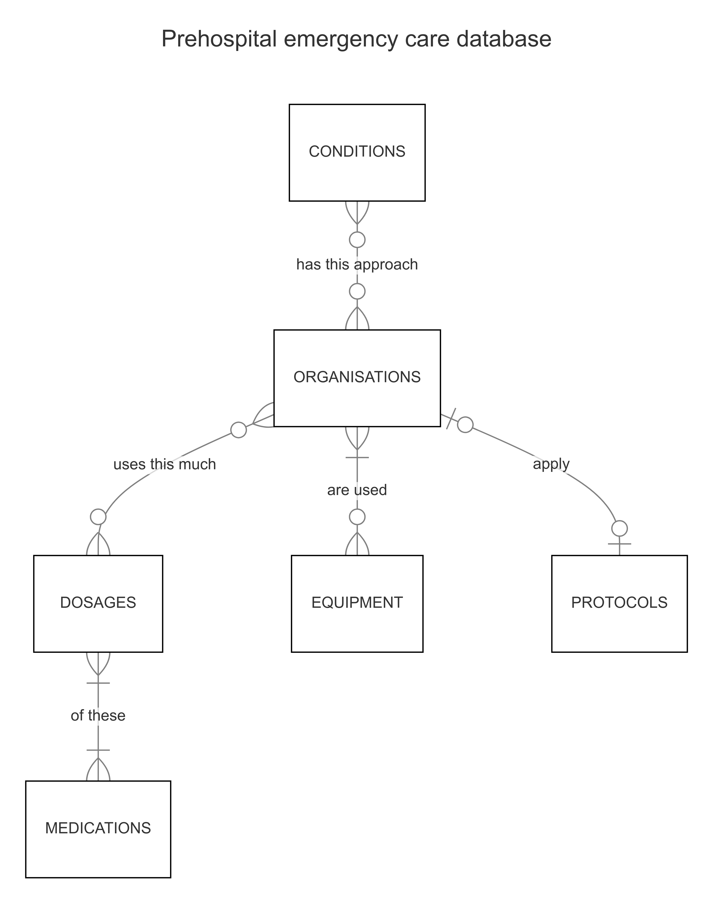
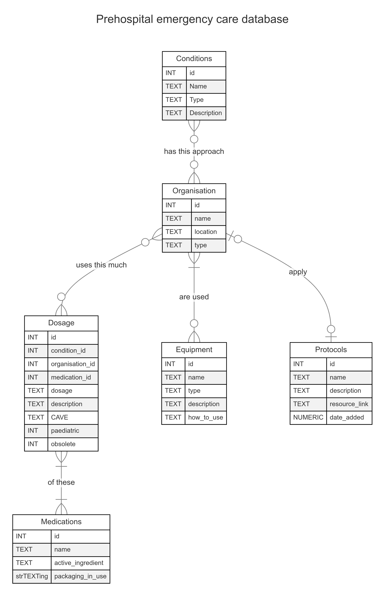

# Design Document - PREHOSPITAL EMERGENCY CARE (PEC) DATABASE

By Vojtěch Černý

Video overview: <[URL HERE](https://youtu.be/uXyWEmodLx0)>

## Usecase

A database like this would be ideally suited to be used within a mobile or web application made for the same purpose as this database. It could enable users to easily access the information within through user friendly GUI and therefore provide them with a valuable and easily accessible resource they can fall back on.

It could provide such services to multiple organisations through authorized log ins for example.

As such it could serve multiple purposes. 
* knowledge base of the organisation
* standardisation of approach and care
* onboarding of new employees
* education resource
* cheat sheet

## Scope

This database is aimed at first responders, mostly paramedics, emt's and other medical proffesionals, to help them familiarize them selves with the local protocols concerning medications, equipment and approaches towards certain conditions. The other usecase is a handy cheat sheet when they are not certain how to approach certain condition or what is the correct dosage of a medication they have not used in a while for example.

This database is made to connect medications, protocols and equipment used within the prehospital emergency care setting with certain conditions that might be encountered by first responders, paramedics and emt's. It is also created with scaling in mind and could therefore provide this information to different organisations within the field. As a database like this would mostly be used for queriing and inserts and changes would probably not happen as often, it is made with SQLite.

Only equipment, medications a protocols connected with the prehospital setting are within the scope of this database. It would not include any specialised medications or procedures that are not available to the medical proffessionals in the field.

## Functional Requirements

In this section you should answer the following questions:

* What should a user be able to do with your database?
* What's beyond the scope of what a user should be able to do with your database?

The user should be able to see pre-made views and run queries on them. The user can also insert into the database new conditions, new connections, new protocols, new equipment, new medications and dosages. The user should also be able to soft delete. None of the values inputed should be ever deleted.

## Representation

### Entities

In this section you should answer the following questions:

* Which entities will you choose to represent in your database?
This database includes six entities that are connected to each other. These represent some major topics for use within the Prehospital emergency care setting. Specifically, these are:
#### Conditions

- These repserent the conditions a prehospital emergency care provider might encounter while on duty. It could be a heart attack, a stroke, or an OHCA(Out of hospital cardiac arrest).

There are three columns in the conditions table. These are:
* name (TEXT NOT NULL UNIQUE) -> The name is the defining quality of a condition. It has to have a unique name which enables it to be clearly linked to a certain protocol, equipment and specific dosages of medications.
* type (TEXT NOT NULL) -> The condition's type can enable easier sorting through conditions if necessary.
* description (TEXT NOT NULL) -> The description is important for diferentiation of conditions.

#### Organisations

- Organisations are the providers that might choose to participate in an application that uses this database. Inclusion of these enables scaling the database and would enable multiple providers to share information and use similar approaches to treating similar conditions.

There are three columns in the organisations table. These are:
* name (TEXT NOT NULL UNIQUE) -> This is the main identifier of an organisation. 
* location (TEXT NOT NULL) -> Some extra data serving as an extra identifier.
* type (TEXT NOT NULL CHECK("type" IN ('Emergency medical service', 'Private provider', 'Hopital provider', 'Fire Rescue', 'Other'))) -> This is an extra identifier and it may serve as a basis for data analysis.

#### Protocols 

- Protocols are like algorithms for prehospital emergency care. They enable standardised care with standardised quality across the area the EMS provider serves.
- They also help the providers them selves in case they are not sure by providing a clear guidance on how to solve generalised situations. 
- If done right, they can enable providers to provide good quality care without really knowing why things work the way they do.

There are four columns in the protocols table. These are:
* name(TEXT NOT NULL) -> This is one of the main identifiers of a protocol. It is not unique since different organisations may have a different protocol for the same condition under the same name. If this turns out to not be functional, it may be changed later.
* description (TEXT NOT NULL) -> This column should contain the main information package of the protocol. Even though it is not directly limited in lenght, it should be relatively short.
* resource_link (TEXT NOT NULL) -> This column should provide additional information and context for the protocol in question.
* date_added (NUMERIC NOT NULL DEFAULT CURRENT_TIMESTAMP) -> This column represents the age of a protocol. Based on this, a protocol renewal might be recommended in the applacation using this database.

There may be additional columns added to this db. A BLOB column comes in mind. It could contain a graphical representation of a protocol. However, it has not been implemented yet.

The protocols table is connected to conditions and organisations via a junction table which contains ids' of protocols, organisations and conditions. This junction table also contains the "obsolete" flag variable which enables soft delete by marking only the connection as obsolete.
#### Equipment

- Equipment represents the sum of all devices, gadgets and tools in use by the prehospital care providers.

There are four columns in the equipment table. They are:
* name (TEXT NOT NULL UNIQUE) -> A unique identifier of each piece of equipment.
* type (TEXT NOT NULL CHECK ("type" IN ('transport', 'extrication', 'diagnostics', 'therapeutical', 'other', 'diagnostics/therapeutical'))) -> representing the type of a particular piece of equipment. This could make sorting, searching and inserting easier.
* description (TEXT NOT NULL) -> description of a particular piece of equipment, of it's functions. List of features.
* how_to_use (TEXT NOT NULL) -> a description of the mode of operation, safe handling etc.

The equipment table is connected to conditions and organisations via a junction table which contains ids' if equipment, organisations and conditions.

In a future itteration, there may be several BLOBS added. Those could represent visual manuals or videos on how to use the pieces of equipment. This junction table also contains the "obsolete" flag variable which enables soft delete by marking only the connection as obsolete.

#### Medications

- These represent the medications that might be given to patients.

The medications table has only three columns:
* name (TEXT NOT NULL UNIQUE) -> A unique identifier of medications.
* active_ingredient (TEXT NOT NULL) -> The active ingredient may be the same in multiple medications, therefore it is not unique. Different companies make generics.
* packaging_in_use (TEXT NOT NULL) -> thich column contains the currently used packaging. This might prove not functional while in use so may be subject to change.

The medications table is connected to conditions and organisations through dosages.

#### Dosages

- Serve as a junction table and a normal table all in one. It connects specific medications with specific conditions and organisations. 
- The same medication could be beneficial for patients that are suffering from different conditions but it might be in a different dose. 
- Different companies might also choose to use different medications for the same conditions because of a multitude of reasons.

The dosages table has multiple columns:
* condition_id (INTEGER NOT NULL) -> connector to conditions
* organisation_id (INTEGER NOT NULL) -> connector to organisations
* medication_id (INTEGER NOT NULL) -> connector to medications
* dosage (TEXT NOT NULL) -> States the correct dosage of specific medication for a specific condition that belongs to the protocols of a certain organisation.
* description (TEXT NOT NULL) -> Describes the way the medication in this dosage works, what it can do with the patient.
* cave (TEXT NOT NULL) -> CAVE represents some special considerations the provider should be informed about. These can include side effects, interactions with other medication or contraindications.
* paediatric (INTEGER NOT NULL) -> A flag variable marking whether this particular dosage can be applied when taking care of a child patient.
* obsolete (INTEGER NOT NULL DEFAULT 0) -> "obsolete" flag variable which enables soft delete by marking only the connection as obsolete.

#### Logs

The logs table logs any updates, inserts and deletes within the database. It was designed to also contain a user identifier though that functionality is expected to be implemented within the overarching application using this database.

#### VIEWS

There are three views created for this database.
* current_protocols contains all protocols combined with condition name that have not been marked as obsolete.
* current_equipment contains all equipment that has not been marked as obsolete.
* current medications shows a combination of columns from the medications and dosages tables that have not been marked as obsolete.
#### TRIGGERS

Some triggers were added to the database for mostly for logging purposes as they insert into the logs table when any other table is changed.

Two triggers, specifically on the medications and conditions table were created to prevent any deletes from those tables at all since the conditions and medications may be used by different organisations. 

The logging triggers partly also contain this functionality so when a DELETE query is run, it is sometimes instead transformed into an UPDATE query that changes the "obsolete" flag variable's value.
### Relationships

Conditions and organisations are the main tables everything is connected to. Every protocol, piece of equipment and dosage is connected to a condition within which it can be reasonably used. Organisations are sort of a middle man in this relationship. They allow multiple organisations to use the same database. In my oppinion it is reasonable to assume that different organisations within the field of prehospital emergency care would use similar protocols, equipment and medications in a similar way. That is the reason the database is structured this way.

## Optimizations

Indexes were created for the names of all rows within all major tables. That means excluding the connector tables. These indexes were created because I expect users to search the database based on names of certain things, be it Protocols, Equipment, Medications or their Dosages.

## Limitations

### Limitations of design

* Updates of the database may be harder to achieve using this structure and SQLite. This tradeof was made since this database would be expected to be run on mobile devices and the lightweight nature of SQLite seemed to be an advantage. However, if the database were to scale, a different DB management tool could be chosen.
* The database is not really secure in its' current form. Even though it would probably be encrypted, if an unathorized agent gained access to the underlying tables, it would not be hard do mess with the data. Then again, this database does not store any sensitive information and the application using it would run on a local copy so it could be not an issue at all.
* The database was designed to be used by an application. That means that the raw unformated data within it might not be user friendly to understand and to orient in.
### What might this database not be able to represent very well?

Mostly protocols since they tend to get quite lengthy. If too many resources and to much complex descriptions were added, there would surely be major overlap of data within the database and the user output might get less user friendly. In its' current form, when the data is not being shown by a user friendly GUI, it is hard to read and hard to orient in.

## Sample data
When this database is created using the schema.sql file, there are two additional files included that should populate the db with sample data. 
* firstly .read sample_inserts.sql should be run to input some examples of conditions, organisations, protocols, equipment and medications.
* secondly .read sample_inserts.sql should be run to input into the junction tables some connecting values and into the dosages table some examples of dosages connected to specific conditions.
